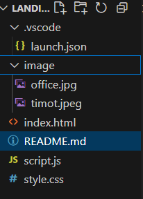

# 🌐 MBC Laboratory Landing Page

Welcome to the official landing page for **MBC Laboratory** — an innovative hub for technology, research, and data solutions. 

This website showcases our services, divisions, contact form, and developer profile — all within a clean and responsive design.

---
## 🗂 Project Structure


💻 Local Installation

  To run the project locally on your machine:

  ```bash
  git clone https://github.com/username/mbc-lab-landing.git
  cd mbc-lab-landing
  ```

  Then simply open index.html in your preferred web browser.

---
🚀 Deployment with Vercel
  1. Log in to Vercel.
  2. Connect your GitHub account and select this repository.
  3. Click Deploy.
  4. Your site will be live at:
  https://mbc-landing-page-three.vercel.app/

  ✅ HTTPS is enabled automatically via Vercel's free SSL.
---
📬 Contact Form (Backend)
  The contact form uses Formspree — no custom backend needed.

  Here’s the form structure used in this site:
```bash
  <form action="https://formspree.io/f/mnnvrggg" method="POST">
    <input type="text" name="name" required />
    <input type="email" name="email" required />
    <textarea name="message" required></textarea>
    <button type="submit">Send</button>
  </form>
```
---
📱 Responsive Design
  1. ✅ Fully responsive — optimized for mobile, tablet, and desktop.
  2. 🎨 Built with modern HTML5 + CSS3.
  3. 🎯 Icons from Tabler Icons and Font Awesome.
---
🛡 IDS Integration (Optional)
  Currently: No Intrusion Detection System (IDS) implemented.
  You may integrate tools like Snort, Suricata, or Wazuh for enhanced security in a backend        version.
---
👨‍💻 About the Developer
  
  Timothy Hinsan Widjaja
    🎓 Informatics Student
    📧 racataxs@gmail.com
    🧳 [Portfolio](https://drive.google.com/drive/folders/1dtLUNppOOJzxYLX-3NDDeQm6kmPiW-5z)
    🔗 [LinkedIn](https://www.linkedin.com/in/timothy-widjaja-1746982a2/)
---
